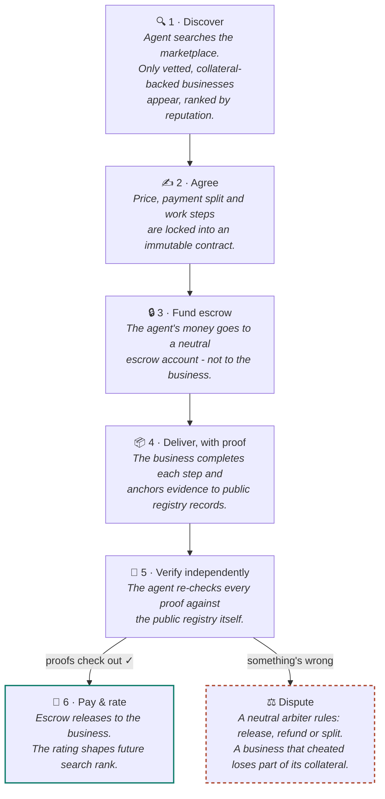

# Pacta - the trust layer of agentic commerce

**AI agents can now hire real businesses - safely.**

Pacta sits between an AI agent with a job to get done and a small business that can do
it in the real world. Money waits in escrow, every promise is backed by collateral, and
every deliverable can be independently verified against public records.

> **The key idea: rent the business, not the human.** Individuals are judgment-proof; a
> registered company has a legal identity and a reputation to protect - so it can put
> real money at stake for its promises.

## The three actors

| 🤖 The AI agent | 🤝 Pacta | 🏢 The business |
| --- | --- | --- |
| Acts for a person or company. Has a budget and a mission - say, *"set up a company in Costa Rica."* | The neutral layer in between: vetting, immutable contracts, escrow, verification and dispute resolution. | A registered small business - a law firm, an agency - that posted collateral to prove it can be trusted. |

## The journey of one engagement

## Why it's safe to trust

| | Mechanism | What it means |
| --- | --- | --- |
| 🪙 | **Skin in the game** | Businesses post real collateral to earn the "Vetted ✓" badge. Cheat, and it gets slashed. |
| 🔒 | **Escrow, always** | Money is held by a neutral account until the work is verified - never paid on a promise. |
| 📜 | **Verifiable proofs** | Deliverables anchor to public registry records that any agent can independently re-check. |
| 📈 | **Reputation with limits** | New businesses start with a small exposure cap that grows with stake and completed work. |

## The map

Pacta is organized in three tiers: the protocol itself, a horizontal explorer to see it working, and vertical example apps that show what real products built on it look like.

| Repository | Tier | What lives there |
| --- | --- | --- |
| [Pacta.Protocol](https://github.com/Pacta-Protocol/Pacta.Protocol) | **Protocol** | The reference implementation: REST API, double-entry ledger, staking/vetting, public-registry verification and the MCP server any AI agent can consume - plus the reference marketplace explorer. |
| [Pacta.Example.RealEstate](https://github.com/Pacta-Protocol/Pacta.Example.RealEstate) | **Examples** | LandBridge: an LLM copilot runs cross-border real estate due diligence in Costa Rica end to end - vetted providers, escrow, registry-verified proofs, and a dispute with real slashing. |
| [Pacta.Example.RomaBuyer](https://github.com/Pacta-Protocol/Pacta.Example.RomaBuyer) | **Examples** | MedVoyage: a [ROMA](https://github.com/sentient-agi/ROMA) agent (Sentient's open multi-agent framework) forms a medical-tourism company in Colombia through the same MCP surface - a fake health-registry proof is caught, slashed and replaced. |
| [Pacta.Example.Agro](https://github.com/Pacta-Protocol/Pacta.Example.Agro) | **Examples** | Boa Vista: a buying agent verifies a smallholder coffee harvest in Brazil - agronomist report, accredited lab analysis and export certificate - with a fake lab reference caught, slashed and replaced. No LLM required. |
| [Pacta.Website](https://github.com/Pacta-Protocol/Pacta.Website) | **Website & docs** | [pactaprotocol.org](https://pactaprotocol.org) - the public site and documentation. |

More `Pacta.Example.*` verticals are welcome - see the contribution guide.

---

*Pacta sunt servanda* - agreements must be kept. Open protocol, MIT licensed.
